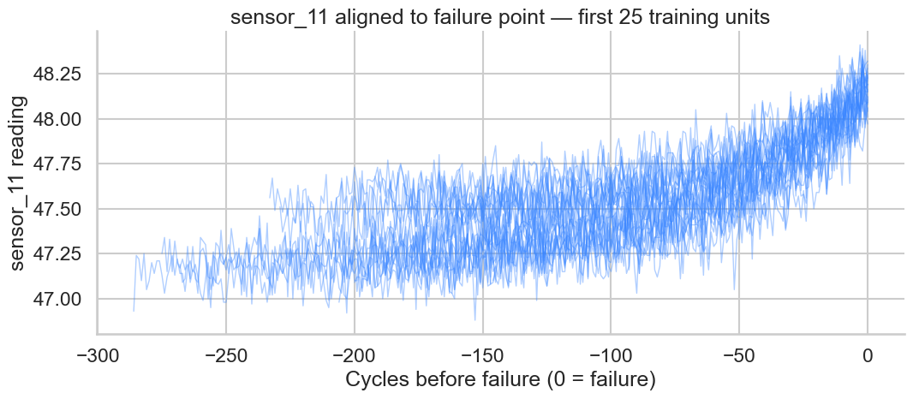
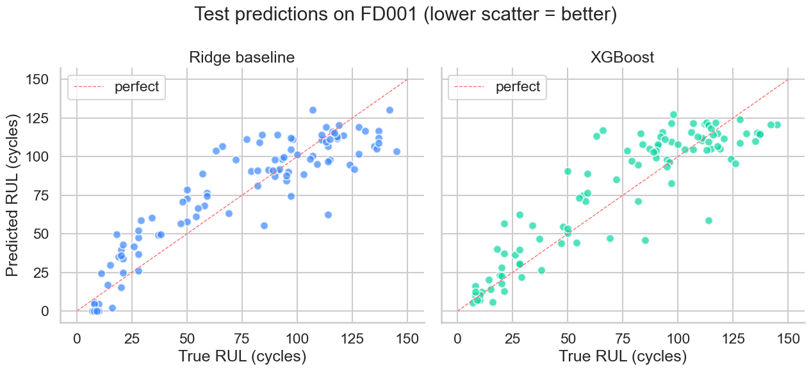
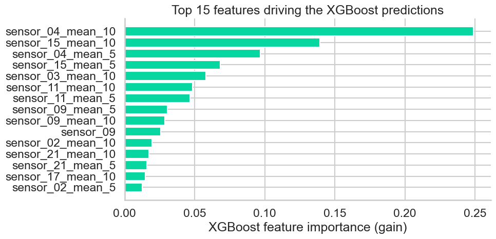
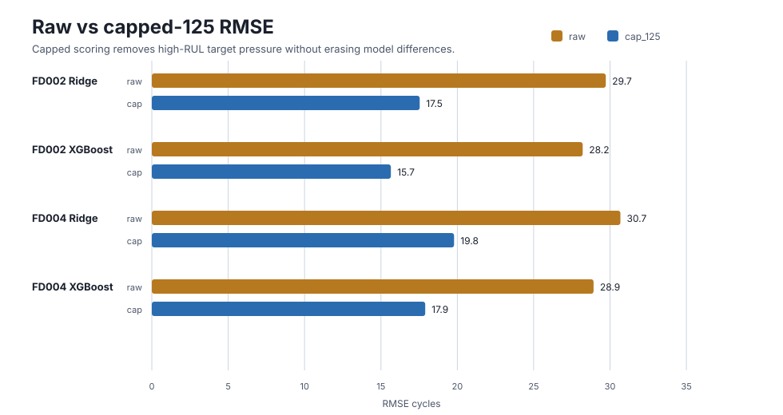
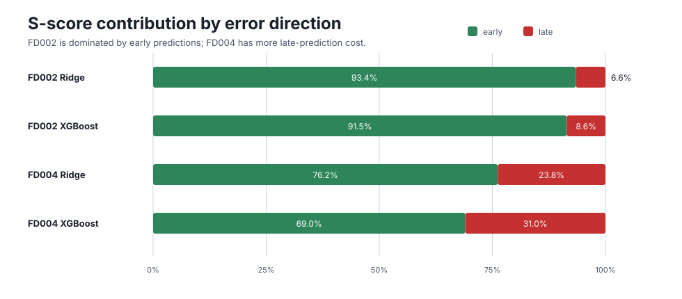
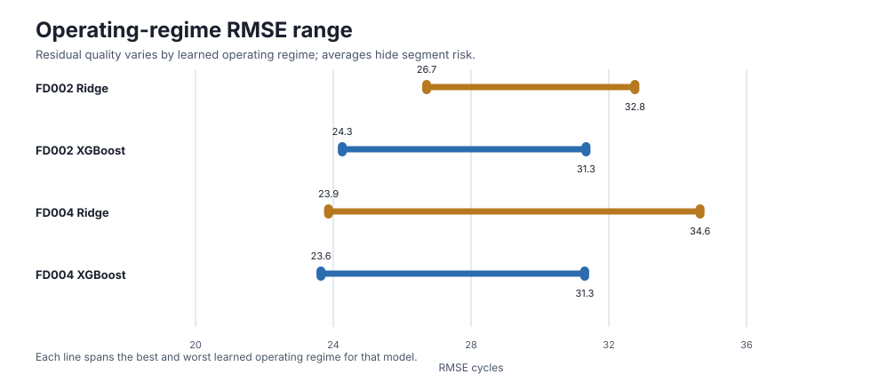

# Predictive Maintenance with NASA CMAPSS

[](https://github.com/eastani/predictive-maintenance-cmapss/actions/workflows/ci.yml)
[](https://www.python.org/)
[](LICENSE)
[](https://github.com/astral-sh/ruff)

End-to-end predictive maintenance pipeline for industrial rotating equipment,
demonstrated on NASA's **CMAPSS** turbofan engine degradation dataset. From
raw sensor ingestion to remaining useful life (RUL) prediction, benchmarked
notebooks, and production-style Python package structure.

> Built as a public reference implementation. The architecture mirrors the
> patterns used in real industrial IIoT platforms - separating data
> contracts, feature engineering, model lifecycle, and serving so each layer
> can be tested and replaced independently.

---

## At a glance

| Area | What is included |
| ---- | ---------------- |
| Dataset | NASA CMAPSS FD001-FD004 turbofan run-to-failure data |
| Pipeline | Strict schema validation, RUL labelling, rolling features, model evaluation |
| Models | Ridge baseline and XGBoost RUL regressor on identical features |
| Multi-regime support | Operating-regime clustering and per-regime sensor normalization for FD002/FD004 |
| Serving | FastAPI inference service, model artifact format, Dockerfile, and API tests |
| Evidence | Executed notebooks with RMSE, asymmetric S-score, and feature diagnostics |
| Engineering | Importable `pdm` package, pytest coverage reporting, Ruff, GitHub Actions CI, `uv` lockfile |
| Documentation | MkDocs Material site covering methodology, benchmarks, experiment planning, operations, and roadmap |
| Next step | Expand repeated-run LSTM evaluation beyond FD001 |

## Key findings

- **Model capacity helps conditionally, not universally.** XGBoost improves RMSE
  across FD001-FD004, but it worsens asymmetric S-score on FD001/FD003. The
  stronger model is most useful on FD002/FD004, where multiple operating
  regimes make non-linear interactions matter more.
- **Regime-aware preprocessing is evidence-backed.** On FD002/FD004,
  operating-regime clustering plus per-regime normalization improves the
  multi-condition benchmarks, and per-regime diagnostics show the remaining
  errors are not uniform across operating states.
- **Target convention changes the interpretation.** Raw FD002/FD004 labels
  include high-RUL values above the 125-cycle training cap. Reporting raw and
  capped-125 metrics side by side prevents overreading high-RUL compression as
  only an architecture failure.
- **Failure direction matters operationally.** S-score contribution diagnostics
  show FD002 is dominated by early, over-conservative predictions, while FD004
  has a larger late-prediction share. Lower RMSE alone is not enough for a
  maintenance policy.

## Results preview

The figures below are exported from the executed notebooks in this repository.

### Sensor degradation aligned to failure



Sensor 11 shows a visible drift pattern as units approach failure, which
supports the choice to focus model capacity on the observable degradation
window.

### Ridge baseline vs. XGBoost



The FD001 benchmark compares Ridge and XGBoost on identical rolling features.
The result is intentionally reported as a close head-to-head rather than a
headline-only model win.

### Feature importance diagnostics



The top XGBoost features line up with the high-pressure-compressor sensor
signals surfaced during exploratory analysis, giving the model results a
domain-level sanity check.

### Benchmark diagnostic charts



Raw and capped-125 scoring are reported side by side because high-RUL labels
above the training cap can change how model errors should be interpreted.



The asymmetric S-score is split by error direction so maintenance risk is not
reduced to a single headline metric.



The regime range view shows how much aggregate scores can hide segment-level
variation under multiple operating conditions.

## Why this project

Industrial predictive maintenance combines three problems that are usually
treated separately:

1. **Data engineering** - heterogeneous, irregularly sampled sensor streams
   per asset, with multiple operating regimes and censored failure data.
2. **Modelling** - survival-style RUL regression where labels are noisy,
   right-censored, and unevenly distributed.
3. **Operationalisation** - alerts must be calibrated, traceable, and tied
   back to specific assets and time windows for the maintenance team to act.

This repository tackles all three on a public dataset, with a code structure
that reflects how the same pipeline would be deployed against live OPC-UA /
historian data.

## Architecture

```
raw sensor files
FD001-FD004
      |
      v
+-----------------------------+
| pdm.data                    |
| - CMAPSS loader             |
| - train/test split          |
| - contract validation       |
| - RUL labelling             |
+-------------+---------------+
              |
              v
+-----------------------------+
| pdm.features                |
| - constant-sensor filter    |
| - rolling statistics        |
| - per-unit windows          |
| - regime-aware normalisation|
+-------------+---------------+
              |
              v
+-----------------------------+
| pdm.models                  |
| - Ridge baseline            |
| - XGBoost RUL regressor     |
| - evaluation metrics        |
+-------------+---------------+
              |
              v
+-------------+---------------+----------------+
| pdm.serving | pdm.api       | tests + CI      |
| artifacts   | FastAPI       | pytest/mypy     |
+-------------+---------------+----------------+
```

## Dataset

NASA's [Commercial Modular Aero-Propulsion System Simulation (CMAPSS)][cmapss]
contains four sub-datasets (FD001-FD004) of run-to-failure trajectories
for simulated turbofan engines under varying operating conditions and fault
modes.

| Subset | Train units | Test units | Operating conditions | Fault modes |
| ------ | ----------- | ---------- | -------------------- | ----------- |
| FD001  | 100         | 100        | 1                    | 1 (HPC)     |
| FD002  | 260         | 259        | 6                    | 1 (HPC)     |
| FD003  | 100         | 100        | 1                    | 2 (HPC, Fan)|
| FD004  | 248         | 249        | 6                    | 2 (HPC, Fan)|

Each row contains 21 sensor channels plus 3 operational settings, indexed by
unit number and operating cycle. The training trajectories run until failure;
the test trajectories are truncated and the goal is to predict the
remaining useful life (RUL) of each test unit.

[cmapss]: https://www.nasa.gov/intelligent-systems-division/

## Quickstart

```bash
# 1. Clone and install
git clone https://github.com/eastani/predictive-maintenance-cmapss.git
cd predictive-maintenance-cmapss
uv sync

# 2. Download the CMAPSS dataset (places files into data/raw/)
./scripts/download_data.sh

# 3. Run the test suite
uv run pytest

# 4. Train a local model artifact for the API
uv run python scripts/train_fd001_artifact.py --data-dir data/raw --out artifacts/fd001-ridge.joblib

# 5. Launch the inference API
PDM_MODEL_PATH=artifacts/fd001-ridge.joblib uv run uvicorn pdm.api:app --reload

# 6. Launch the EDA notebook
uv run jupyter lab notebooks/01_eda.ipynb
```

## Documentation Site

```bash
uv sync --extra docs
uv run mkdocs serve

# Strict build check
uv run mkdocs build --strict
```

## Contributing

Contributions are welcome, especially focused documentation, diagnostics, and
reproducibility improvements. Start with [CONTRIBUTING.md](CONTRIBUTING.md)
before opening an issue or pull request. Experiment proposals should state the
hypothesis, baseline, metrics, and rejection criteria before adding new model
complexity.

## Cross-Subset Evaluation

FD001 is intentionally simple: one operating condition and one fault mode.
FD002 and FD004 mix six operating conditions, so the evaluation script enables
standardized operating-regime clustering and per-regime sensor normalization
for those subsets before fitting the same model interface.

```bash
# Ridge baseline across all four subsets
uv run python scripts/evaluate_subsets.py --data-dir data/raw

# Ridge + XGBoost, writing a CSV report
uv run python scripts/evaluate_subsets.py \
  --data-dir data/raw \
  --with-xgboost \
  --out reports/cross_subset_results.csv

# Regime-aware ablation on the multi-condition subsets
uv run python scripts/evaluate_subsets.py \
  --data-dir data/raw \
  --subsets FD002 FD004 \
  --with-xgboost \
  --regime-mode both \
  --out reports/regime_ablation_fd002_fd004.csv
```

The report includes RMSE, CMAPSS S-score, sample counts, feature counts, and
whether regime-aware features were enabled. It also exports per-unit
predictions, raw-vs-capped target diagnostics, and operating-regime residual
diagnostics so target conventions and segment-level failures can be checked
explicitly. This is the benchmark harness for showing where model capacity
matters, instead of claiming that XGBoost wins everywhere.

Latest measured results:

| Subset | Model | RMSE | S-score | Features | Regime-aware |
| ------ | ----- | ---: | ------: | -------: | ------------ |
| FD001 | Ridge | 18.27 | 592.60 | 105 | No |
| FD001 | XGBoost | 18.23 | 814.84 | 105 | No |
| FD002 | Ridge | 29.72 | 15,282.53 | 294 | Yes |
| FD002 | XGBoost | 28.21 | 11,269.47 | 294 | Yes |
| FD003 | Ridge | 19.17 | 720.01 | 112 | No |
| FD003 | XGBoost | 18.72 | 1,412.19 | 112 | No |
| FD004 | Ridge | 30.68 | 6,946.85 | 294 | Yes |
| FD004 | XGBoost | 28.92 | 5,912.41 | 294 | Yes |

The pattern is the useful part: XGBoost improves RMSE across all subsets, but
only improves the asymmetric S-score on FD002 and FD004, where multiple
operating regimes make non-linear interactions more valuable. On FD001 and
FD003, the extra model capacity makes more costly late predictions even when
RMSE moves slightly lower.

Regime-feature ablation on the multi-condition subsets:

| Subset | Model | Regime-aware | RMSE | S-score | Features |
| ------ | ----- | ------------ | ---: | ------: | -------: |
| FD002 | Ridge | No | 30.64 | 17,835.85 | 147 |
| FD002 | XGBoost | No | 30.05 | 12,840.71 | 147 |
| FD002 | Ridge | Yes | 29.72 | 15,282.53 | 294 |
| FD002 | XGBoost | Yes | 28.21 | 11,269.47 | 294 |
| FD004 | Ridge | No | 31.71 | 7,861.98 | 147 |
| FD004 | XGBoost | No | 31.49 | 8,825.88 | 147 |
| FD004 | Ridge | Yes | 30.68 | 6,946.85 | 294 |
| FD004 | XGBoost | Yes | 28.92 | 5,912.41 | 294 |

The ablation supports the regime-aware preprocessing choice rather than merely
assuming it. On FD004 especially, XGBoost without regime-aware features lowers
RMSE slightly versus Ridge but worsens S-score; adding regime-normalized
features makes the non-linear model useful under both metrics.

## Sequence Modelling

The sequence window builder prepares CMAPSS data for recurrent models without
changing the benchmark contract: training gets cycle-ending sliding windows,
while test evaluation gets exactly one final-cycle window per engine.

```python
from pdm.data import load_subset
from pdm.sequences import build_sequence_dataset

data = load_subset("FD001", "data/raw")
seq = build_sequence_dataset(data, sequence_length=30, stride=1)

seq.train_x.shape  # (train windows, 30, n_features)
seq.test_x.shape   # (test units, 30, n_features)
seq.test_lengths   # valid timesteps for left-padded short trajectories
```

This is intentionally separate from the tabular rolling-feature benchmark.
It prevents a common CMAPSS mistake: scoring every truncated test cycle as if
it had a label, which inflates the sample count and makes the LSTM comparison
look more reliable than it is.

An optional PyTorch LSTM baseline is available behind the `deep` extra:

```bash
uv sync --extra deep
uv run python scripts/evaluate_lstm.py \
  --data-dir data/raw \
  --subsets FD001 \
  --sequence-length 30 \
  --hidden-size 32 \
  --epochs 5 \
  --seeds 42 43 \
  --out reports/lstm_results.csv
```

The LSTM uses packed sequences, so short trajectories are masked rather than
treated as full-length zero-padded histories. It also standardizes valid sensor
timesteps and the training target before optimization, then reverses the target
scaling at prediction time.

Measured repeated-run results:

| Subset | Model | Sequence length | Stride | Epochs | Seeds | RMSE mean | RMSE std | S-score mean | S-score std |
| ------ | ----- | --------------: | -----: | -----: | ----: | --------: | -------: | -----------: | ----------: |
| FD001 | LSTM | 30 | 1 | 5 | 2 | 16.88 | 1.24 | 577.76 | 228.28 |
| FD002 | LSTM | 30 | 10 | 3 | 2 | 32.69 | 1.88 | 16,253.71 | 3,784.02 |

The FD001 mean beats the tabular Ridge and XGBoost RMSE above, and is slightly
better than Ridge on S-score, but the variance is too high to claim a stable
sequence-model win. On FD002, the small CPU-friendly LSTM run is not yet
competitive with regime-aware Ridge or XGBoost. This is the useful conclusion:
sequence models need careful tuning and enough training windows before they are
worth the added complexity.

The FD002 diagnostic export shows the largest errors are severe early
predictions on high-RUL units, not a late-prediction failure near imminent
failure. That points to underfitting of the healthy long-RUL regime under the
reduced-window CPU setting.

RUL-band diagnostics narrow this further: the `125+` band drives most of the
FD002 error, while the model's maximum predictions stay below 119 cycles. That
suggests a target-design issue because training RUL is clipped at 125 while the
headline benchmark uses raw test RUL.

When the same FD002 predictions are scored against a capped-125 target, RMSE
falls from `34.02/31.35` to `21.98/19.60` across the two seeds. This does not
make the LSTM a winner; it shows the headline raw-label score mixes model error
with a target-convention mismatch.

The same diagnostic on FD002 Ridge and XGBoost shows that capped scoring
improves the tabular models too: Ridge moves from RMSE `29.72` to `17.54`, and
XGBoost moves from `28.21` to `15.65`. That keeps the conclusion conservative:
target convention matters, but the current evidence still favors the
regime-aware tabular models on FD002.

FD004 is a useful caution: XGBoost keeps the better raw RMSE/S-score and capped
RMSE, but Ridge has the slightly better capped S-score. Regime-level diagnostics
also show that XGBoost is not uniformly better across every learned operating
regime, so model choice should stay tied to the target convention and the cost
of late predictions.

The S-score contribution split adds a second caution. FD002's raw S-score is
dominated by early predictions, but FD004 has a larger late-prediction share,
especially for XGBoost. That means a lower headline RMSE is not enough; the
failure direction still has to match the maintenance policy.

## Dashboard

The benchmark dashboard visualizes RMSE, S-score, and XGBoost-vs-Ridge deltas.
It ships with the measured results above, or it can read a CSV generated by
`scripts/evaluate_subsets.py`.

```bash
# Install dashboard dependencies
uv sync --extra viz

# Run with bundled measured benchmark results
uv run python scripts/run_dashboard.py

# Or run against a freshly generated CSV
uv run python scripts/run_dashboard.py --results reports/cross_subset_results.csv
```

## Serving API

The API serves engineered feature vectors against a persisted
`ModelArtifact`. This keeps the boundary explicit: ingestion and feature
engineering can evolve independently from the inference service.

```bash
# Build the container
docker build -t predictive-maintenance-cmapss .

# Run with a mounted model artifact
docker run --rm -p 8000:8000 \
  -e PDM_MODEL_PATH=/models/fd001-ridge.joblib \
  -v "$PWD/artifacts:/models:ro" \
  predictive-maintenance-cmapss

# Health check
curl http://localhost:8000/health
```

Schema example:

```bash
curl -X POST http://localhost:8000/predict-rul \
  -H "Content-Type: application/json" \
  -d '{"unit_id": 1, "cycle": 120, "features": {"sensor_02_mean_5": 0.1}}'
```

Real requests must provide every feature column stored in the trained
artifact. Missing feature values return a 400 response rather than silently
filling defaults.

## Project layout

```
predictive-maintenance-cmapss/
|-- src/pdm/               # Library code (importable as `pdm`)
|   |-- data.py            # CMAPSS loader + RUL labelling
|   |-- features.py        # Rolling statistics, regime features, normalization
|   |-- models.py          # RUL regression models and metrics
|   |-- sequences.py       # Truncation-safe sequence windows for recurrent models
|   |-- deep.py            # Optional PyTorch LSTM baseline
|   |-- serving.py         # Model artifact loading and prediction helpers
|   |-- dashboard.py       # Benchmark dashboard helpers and Dash app
|   `-- api.py             # FastAPI inference service
|-- tests/                 # pytest unit and integration tests
|-- notebooks/             # Exploratory and benchmark notebooks
|-- scripts/               # Data download and operational helpers
|-- data/raw/              # Untracked; CMAPSS files land here
|-- reports/               # Optional generated benchmark outputs
|-- Dockerfile             # Minimal API container
`-- .github/workflows/     # CI pipeline
```

## Notebooks

* [`notebooks/01_eda.ipynb`](notebooks/01_eda.ipynb) - Exploratory data
  analysis on FD001: trajectory length distribution, sensor variance,
  per-unit degradation curves, alignment to failure, and the empirical
  motivation for piecewise-linear RUL capping.
* [`notebooks/02_baseline_rul.ipynb`](notebooks/02_baseline_rul.ipynb)
  - Baseline RUL regressor on FD001 using rolling features and a
  standard-scaled Ridge regression, evaluated with RMSE and the
  asymmetric CMAPSS S-score. Establishes the floor that subsequent
  models must demonstrably beat.
* [`notebooks/03_xgboost_rul.ipynb`](notebooks/03_xgboost_rul.ipynb)
  - Benchmarks an XGBoost gradient-boosted regressor against the Ridge
  baseline on identical features. Shows the honest result that on
  FD001's single regime / single fault mode, the gap is narrow, and
  uses feature-importance diagnostics to corroborate the EDA findings.

The notebooks are kept paired with `.py` files in the
[jupytext percent format][jupytext], so diffs are reviewable on GitHub.

[jupytext]: https://jupytext.readthedocs.io/

## Roadmap

- [x] CMAPSS data loader with strict schema validation
- [x] Project skeleton, CI, and packaging
- [x] Feature engineering: constant-sensor filter, piecewise-linear RUL,
      rolling statistics
- [x] Exploratory data analysis notebook
- [x] Baseline RUL regressor (Ridge regression) with RMSE / S-score evaluation
- [x] Gradient-boosted RUL regressor (XGBoost) with feature-importance diagnostics
- [x] Operating-regime clustering for FD002 / FD004
- [x] Dockerised serving with a minimal REST API
- [x] Cross-subset evaluation harness for FD001-FD004
- [x] Published cross-subset result table showing where XGBoost actually wins
- [x] Plotly Dash live dashboard
- [x] Sequence-window dataset builder with final-cycle test handling
- [x] LSTM sequence model with proper truncation handling
- [x] Measured LSTM benchmark table with repeated-run variance
- [x] Documentation site (MkDocs Material)
- [x] Preliminary FD002 LSTM repeated-run benchmark
- [ ] Tune and scale LSTM benchmarks beyond FD001

## License

[MIT](LICENSE) - feel free to use this as a starting point for your own
predictive maintenance projects.

## Author

**Naoya Higashitani** -
[LinkedIn](https://www.linkedin.com/in/naoya-higashitani/) |
[Portfolio](https://eastani.github.io/portfolio/) |
[GitHub](https://github.com/eastani)
